# VoxModSynth
A simple, efficient, easily hackable C++ implementation of 3d model synthesis / wave function collapse

	
  A 3D printed, fully walkable, self-supporting castle

## Input / output

- The expected voxel format for inputs is '.slab.vox' as exported by MagicaVoxel (https://ephtracy.github.io/)
- The output (.slab.vox) can be directly imported into MagicaVoxel (use MagicaVoxel viewer for larger outputs, as MagicaVoxel clamps to 128^3)
- Pallete indices are used as tile ids (labels), pallete index 255 is empty, 254 is ground.
- Input files are in subdir exemplars/
- Output is produced in subdir results/

## Constraints (quick tutorial)

The input exemplar is made of 8 bit voxels (0-255), colored by a palette. This conveniently fits voxel editors such as MagicaVoxel. Each index is a 'label' and will later be replaced by a 3D tile. When two voxels are side by side in the input, they are allowed to be neighboring in the same configuration in the output. Everything else is disallowed. This provides the set of constraints. A special label means 'empty' (index 255) and another 'ground' (index 254).

For instance, we can use two labels to produce H shapes: vertical pillars (red) and horizontal bar (white), as follows:

	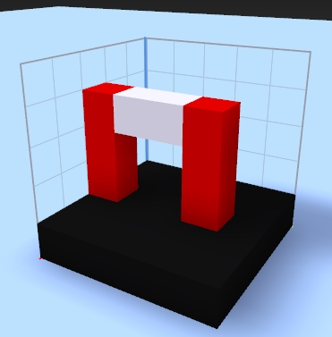
	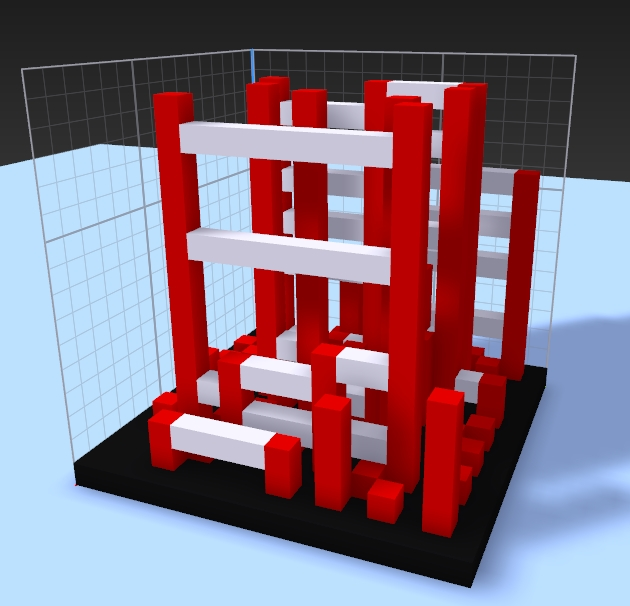

The constraints are fairly simple in this case:
- Red can be just above ground,
- Red can be just above/below red, 
- Red can be left/right of white, 
- White can be left/right of white
- Plus all the cases with the 'empty' label. 
Everything else is forbidden.

The synthesized result reveals an interesting issue: there are red pillars without a white horizontal bar. The reason is that red can be a neighbor with empty along all its faces but below (which only admits red or ground). Thus, it can appear as a single pillar.
How can we avoid this? We need to introduce corner labels, preventing red to exist alone:

	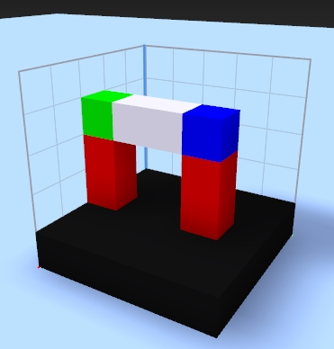
	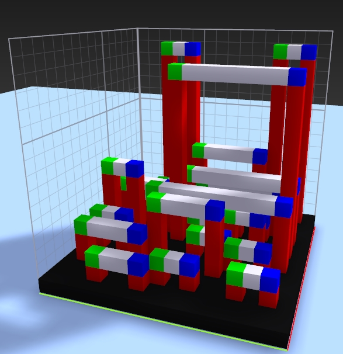

Now a red pillar can only be terminated by green or blue, and white only exists right of green or left of blue. This means the synthesizer can only produce inverted U shapes. It would be nice though to allow for pillars in the middle. We add a third (yellow) label creating a T junction:

	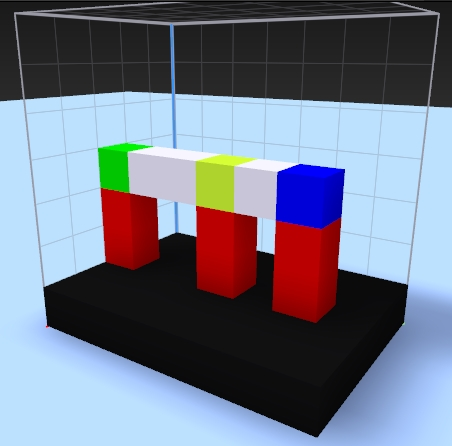
	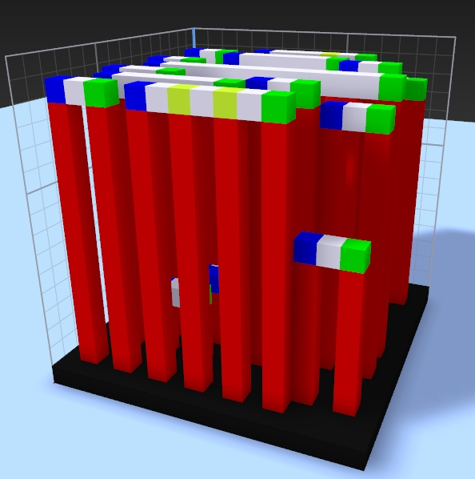

We can also allow the white bars to connect sideways:

	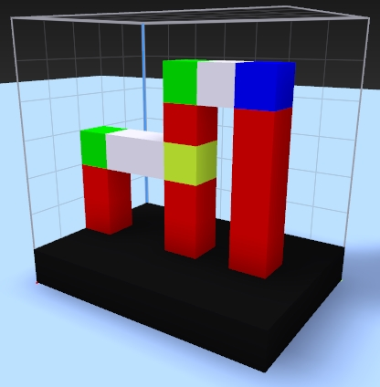
	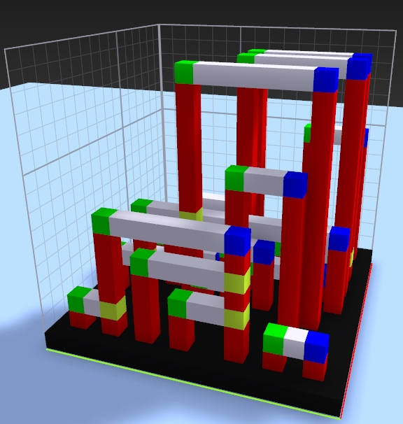

Now we will give it a better 3D flavor, by introducing horizontal bars in the other direction:

	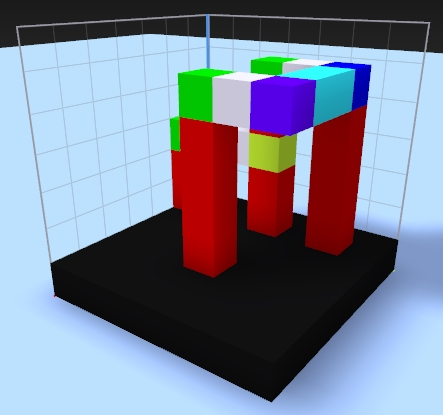
	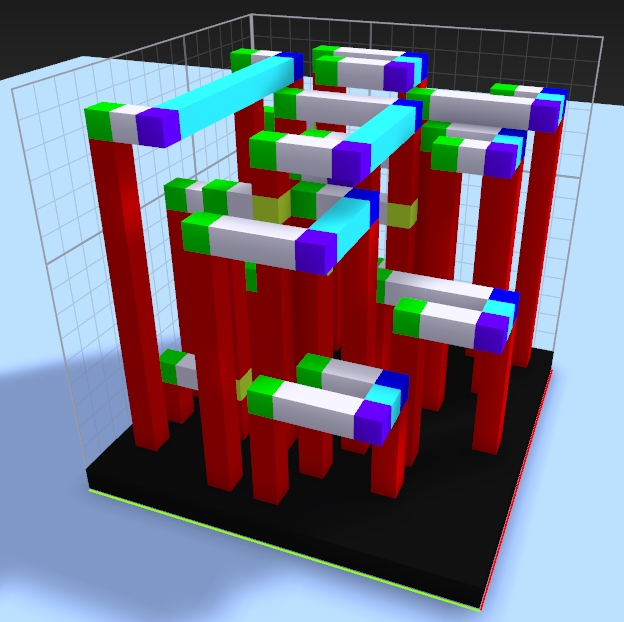

Interesting, but these long red bars do not look too good. Let's modify the exemplar to prevent red from stacking upon itself, which will restrict vertical bars to length one. To do this, I create in the exemplar the stacking I am expecting, ensuring red does not appear above itself.

	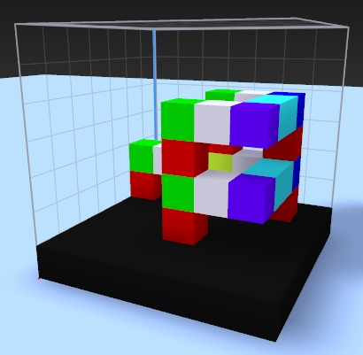
	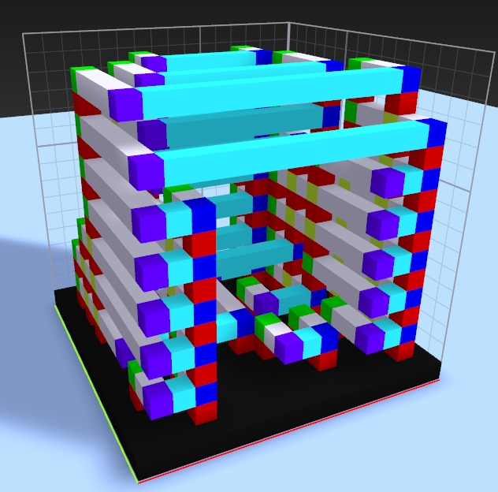

So by now you hopefully get the basic idea of how to specify constraints to allow/disallow some behaviors. This turns into quite a fascinating puzzle game. To make it look good, it is important to replace voxels by nice detailed 3d tiles (the provided code can do that).

After some experiments, I was able to produce the following case (exemplars/towers.slab.vox), also shown above as a 3D printed result:

	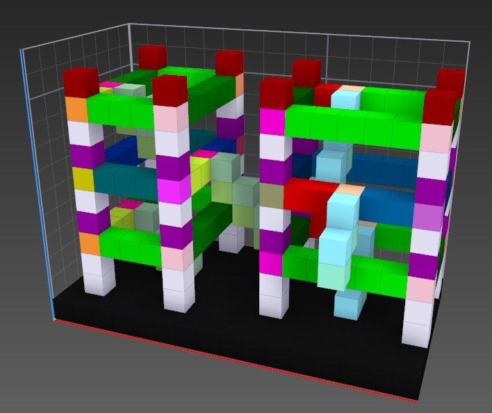
	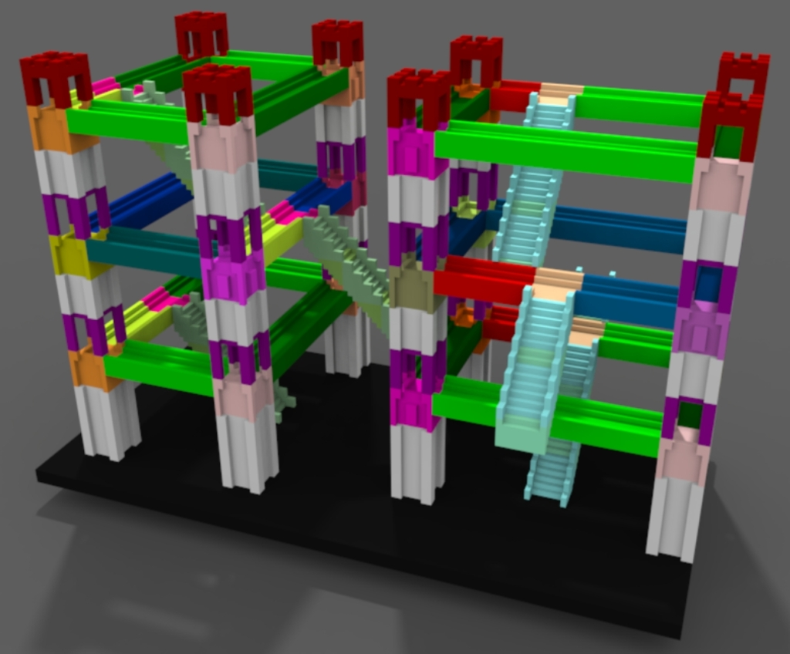
	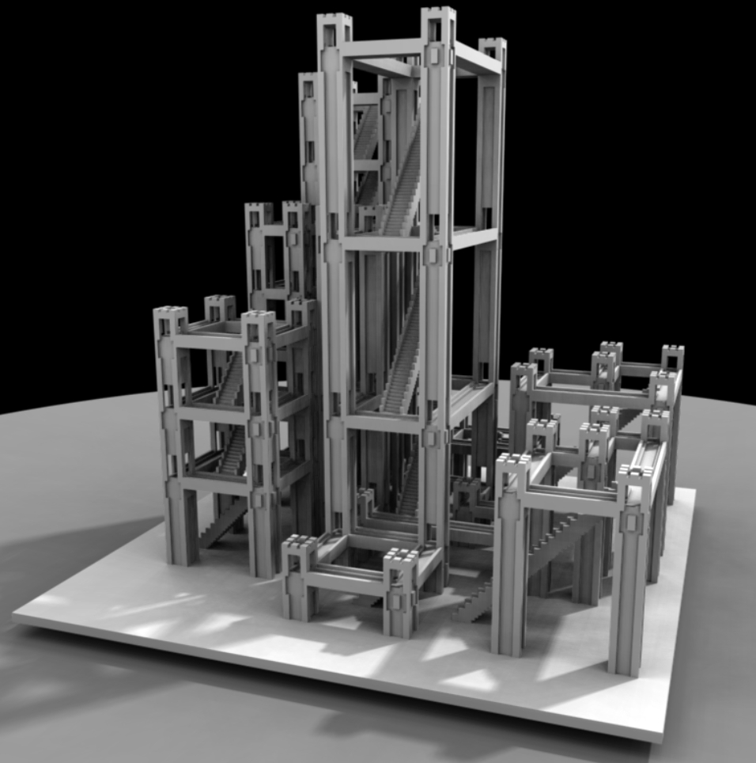
	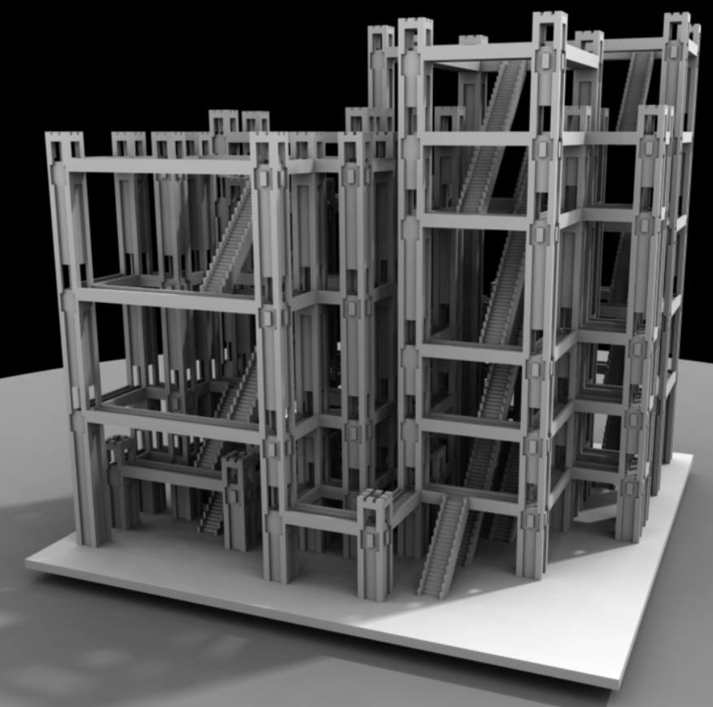
	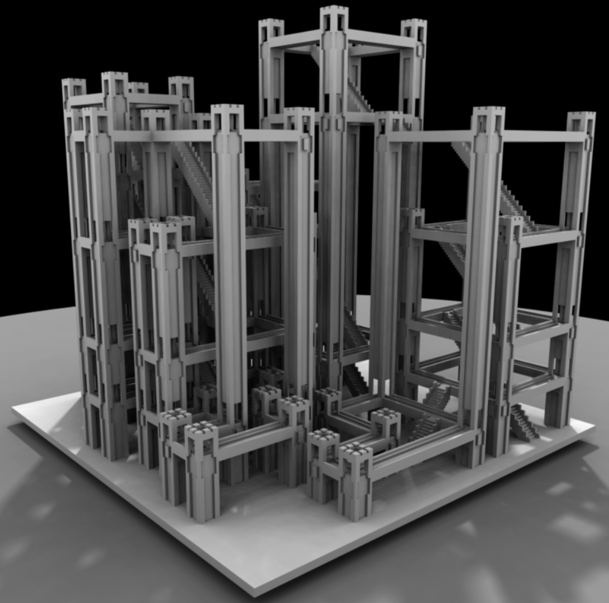
	 
	<b>From left to right:</b> Voxel exemplar, detailed version, three results (24^3 voxel synthesis, 8^3 tiles)

This guarantees that a set of stairs will climb to any level, while giving enough freedom to produce interesting examples. It is quite puzzling that local constraints can be used to guarantee the output is fully connected, self-supporting (for 3d printing) and that all locations are accessible, across all synthesized instances.

Can you generate other fully walkable cases? 

## References

For more details on model synthesis:
- http://graphics.stanford.edu/~pmerrell/ (Example-Based Model Synthesis paper which introduces the core ideas)
- https://github.com/mxgmn/WaveFunctionCollapse (many details, full implementation with a very nice visualization, inspired me to work again on this)
 
## Limitations
- All labels are currently equiprobable (will be updated soon)

@sylefeb
