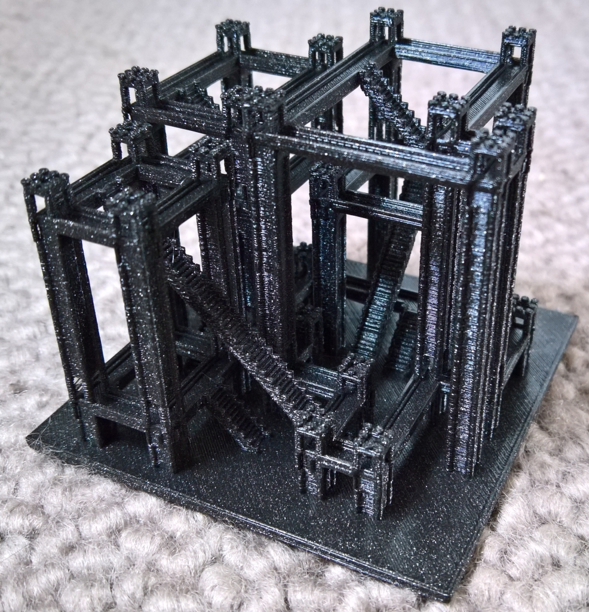

# VoxModSynth
A simple, efficient, easily hackable C++ implementation of 3d model synthesis / wave function collapse

	
  A 3D printed, fully walkable, self-supporting castle

## Input / output

- The expected voxel format for inputs is '.slab.vox' as exported by MagicaVoxel (https://ephtracy.github.io/)
- The output (.slab.vox) can be directly imported into MagicaVoxel (use MagicaVoxel viewer for larger outputs, as MagicaVoxel clamps to 128^3)
- Pallete indices are used as tile ids (labels), pallete index 255 is empty, 254 is ground.
- Input files are in subdir exemplars/
- Output is produced in subdir results/

## Constraints

The input exemplar is made of 8 bit voxels (0-255), colored by a palette. This conveniently fits voxel editors such as MagicaVoxel. Each index is a 'label' and will later be replaced by a 3D tile. When two voxels are side by side in the input, they are allowed to be neighboring in the same configuration in the output. Everything else is disallowed. This provides the set of constraints. A special label means 'empty' (index 255) and another 'ground' (index 254).

## Learn more

For more details on model synthesis:
- http://graphics.stanford.edu/~pmerrell/ (Example-Based Model Synthesis)
- https://github.com/mxgmn/WaveFunctionCollapse
 
## Limitations
- All labels are currently equiprobable (will be updated soon)

@sylefeb

